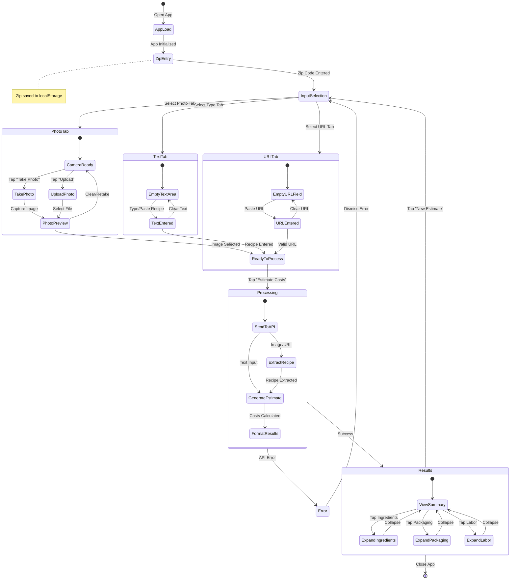

# User State Flow Diagram

## Mermaid Diagram



## Text-Based Flow Diagram

```
┌─────────────────────────────────────────────────────────────────────────────┐
│                           RECIPE COST ESTIMATOR                             │
└─────────────────────────────────────────────────────────────────────────────┘

                                    ┌──────────┐
                                    │ APP LOAD │
                                    └────┬─────┘
                                         │
                                         ▼
                              ┌─────────────────────┐
                              │  ENTER ZIP CODE     │
                              │  (saved locally)    │
                              └──────────┬──────────┘
                                         │
                                         ▼
                         ┌───────────────────────────────┐
                         │     SELECT INPUT METHOD       │
                         └───────────────┬───────────────┘
                                         │
              ┌──────────────────────────┼──────────────────────────┐
              │                          │                          │
              ▼                          ▼                          ▼
     ┌─────────────────┐       ┌─────────────────┐       ┌─────────────────┐
     │   📷 PHOTO      │       │   📝 TYPE       │       │   🔗 URL        │
     └────────┬────────┘       └────────┬────────┘       └────────┬────────┘
              │                         │                         │
     ┌────────┴────────┐                │                         │
     │                 │                │                         │
     ▼                 ▼                ▼                         ▼
┌─────────┐     ┌──────────┐    ┌──────────────┐          ┌──────────────┐
│  TAKE   │     │  UPLOAD  │    │ ENTER RECIPE │          │  PASTE URL   │
│  PHOTO  │     │  IMAGE   │    │    TEXT      │          │              │
└────┬────┘     └────┬─────┘    └──────┬───────┘          └──────┬───────┘
     │               │                 │                         │
     └───────┬───────┘                 │                         │
             │                         │                         │
             ▼                         │                         │
     ┌───────────────┐                 │                         │
     │ PREVIEW IMAGE │                 │                         │
     │  ┌─────────┐  │                 │                         │
     │  │  📸     │  │                 │                         │
     │  └─────────┘  │                 │                         │
     └───────┬───────┘                 │                         │
             │                         │                         │
             └─────────────────────────┼─────────────────────────┘
                                       │
                                       ▼
                         ┌───────────────────────────┐
                         │   TAP "ESTIMATE COSTS"    │
                         └─────────────┬─────────────┘
                                       │
                                       ▼
                         ┌───────────────────────────┐
                         │       ⏳ PROCESSING       │
                         │                           │
                         │  • Extract recipe text    │
                         │  • Analyze ingredients    │
                         │  • Calculate costs        │
                         │  • Generate pricing       │
                         └─────────────┬─────────────┘
                                       │
                    ┌──────────────────┴──────────────────┐
                    │                                     │
                    ▼                                     ▼
          ┌─────────────────┐                   ┌─────────────────┐
          │     ❌ ERROR    │                   │    ✅ SUCCESS   │
          │                 │                   │                 │
          │ • Display error │                   │ Show Results    │
          │ • Auto-dismiss  │                   │                 │
          └────────┬────────┘                   └────────┬────────┘
                   │                                     │
                   │                                     ▼
                   │              ┌──────────────────────────────────────┐
                   │              │           📊 RESULTS VIEW            │
                   │              ├──────────────────────────────────────┤
                   │              │  Recipe Name           Serves: X     │
                   │              ├──────────────────────────────────────┤
                   │              │  ▸ Ingredients          $XX.XX  [+]  │
                   │              │  ▸ Packaging            $XX.XX  [+]  │
                   │              │  ▸ Labor                $XX.XX  [+]  │
                   │              ├──────────────────────────────────────┤
                   │              │  Total Cost             $XX.XX       │
                   │              │  Cost Per Serving       $X.XX        │
                   │              │  Suggested Markup       XX%          │
                   │              ├──────────────────────────────────────┤
                   │              │  ┌────────┐  ┌────────────────────┐  │
                   │              │  │Per Srv │  │  WHOLE RECIPE      │  │
                   │              │  │ $X.XX  │  │     $XX.XX         │  │
                   │              │  └────────┘  └────────────────────┘  │
                   │              ├──────────────────────────────────────┤
                   │              │       [ 🔄 NEW ESTIMATE ]            │
                   │              └──────────────────┬───────────────────┘
                   │                                 │
                   └────────────────┬────────────────┘
                                    │
                                    ▼
                         ┌─────────────────────┐
                         │  RETURN TO INPUT    │
                         │  (Form Reset)       │
                         └─────────────────────┘
```

## State Descriptions

| State | Description |
|-------|-------------|
| **App Load** | Initial app load, loads saved zip code from localStorage |
| **Zip Entry** | User enters their zip code for regional pricing |
| **Input Selection** | User chooses between Photo, Type, or URL input methods |
| **Photo Tab** | Camera/upload interface for recipe images |
| **Text Tab** | Text area for manually entering recipes |
| **URL Tab** | Input field for recipe website URLs |
| **Processing** | API call to OpenAI for extraction and cost analysis |
| **Error** | Display error message, auto-dismisses after 5 seconds |
| **Results** | Expandable cost breakdown with pricing recommendations |

## User Actions

| Action | Trigger | Result |
|--------|---------|--------|
| Enter Zip | Type 5-digit code | Saved to localStorage, enables processing |
| Switch Tab | Tap tab button | Shows corresponding input panel |
| Take Photo | Tap camera button | Opens device camera |
| Upload Image | Tap upload button | Opens file picker |
| Process | Tap "Estimate Costs" | Sends to API, shows loading |
| Expand Section | Tap section header | Shows detailed line items |
| New Estimate | Tap button | Clears form, returns to input |
